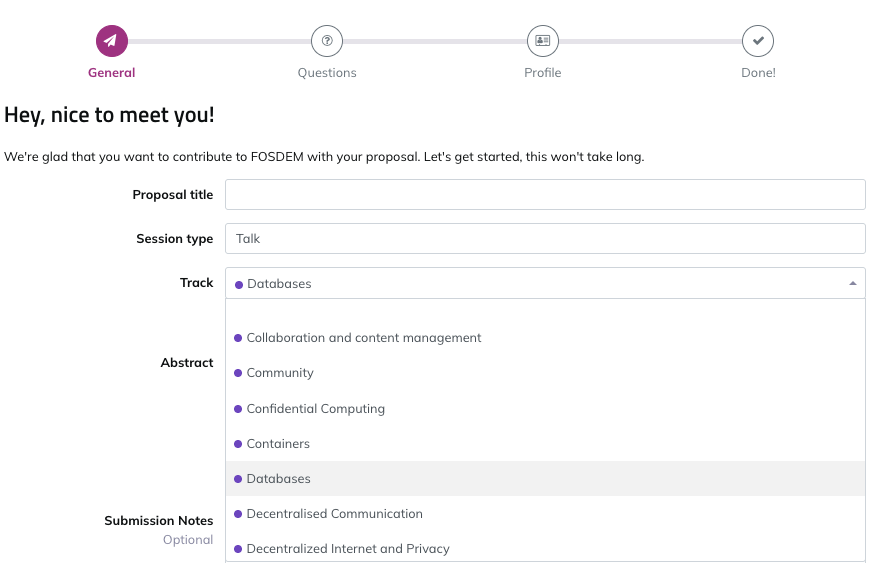

The purpose of this devroom is to discuss developing databases that
can meet the demands of modern applications.

Instead of focusing on a single technology or community, our goal is to
bring open source database communities and developers together to share
their experience, learn from their work, and foster collaboration on
challenges ahead.

## Where

[FOSDEM 2026](https://fosdem.org/2026/) will be hosted in person at [ULB Solbosch Campus, Brussels, Belgium](https://fosdem.org/2026/practical/transportation/).

## Important Dates

*   CFP submission deadline: 3 December, 2025 (at ~23:55 Brussels time)
*   Devroom schedule announced: 15 December, 2025
*   Devroom takes place: **31 January, 2026**

## Suggested Topics

* Evolution of new database architecture (e.g., to address scalability, elasticity, reliability)
* Integrating AI/ML workloads 
* How to ease/streamline database migration (especially from legacy databases)
* Achieving database upgrades without downtime
* How to benchmark and tune distributed databases
* Query optimization 
* Tools/methodologies for monitoring, observability, optimizations, testing, etc.
* Working with streaming data
* Stories from end-users (both successes and failures)
* Security and compliance
* State of open-source licenses and database communities
* Emerging trends/use cases

These are just suggestions and we encourage you to be creative with your proposals! You can also view accepted talks from the 2025 devroom at https://archive.fosdem.org/2025/schedule/track/databases/.

A few Notes:

*   You must be available in person to present your talk at FOSDEM.
*   Speaking slots are 25 minutes in length (including Q&A) with 5 minutes between sessions. Note that due to time constraints, number of submissions, etc., we may end up offering a slot duration different than 25 minutes. 
*   FOSDEM is a [FLOSS](https://en.wikipedia.org/wiki/Free_and_open-source_software) community event, so please ensure your topic is appropriate (i.e., no sales pitches).

## CFP Selection Committee 

| Members (listed alphabetically by first name) | Organization/Communituy |
| --------------------------------------------- | ------------ |
| [Alastair Turner](https://www.linkedin.com/in/decodableminion/)| Percona | 
| [Anna Widenius](https://www.linkedin.com/in/anna-widenius-3a7320b8/) | MariaDB |
| [Daniel van Eeden](https://www.linkedin.com/in/dveeden/) | TiDB |
| [Edith Puclla](https://www.linkedin.com/in/edithpuclla/) | Percona | 
| [Floor Drees](https://www.linkedin.com/in/floordrees/) | EDB | 
| [Hari Krishna Sunder](https://www.linkedin.com/in/hari-db/) | Yugabyte | 
| [Matt Lord](https://www.linkedin.com/in/mattallenlord/) | Vitess |
| [Mattias Jonsson](https://www.linkedin.com/in/mjonss/) | TiDB | 
| [Rohit Nayak](https://www.linkedin.com/in/greenibis/)| Vitess |

## To Submit

Go to the FOSDEM 2026 [Pretalx website](https://pretalx.fosdem.org/fosdem-2026/cfp) to submit your talks and select “Databases” in the Track dropdown menu. 

[Let's get started](https://pretalx.fosdem.org/fosdem-2026/cfp)

## Contacts

*   [Edith Puclla](https://www.linkedin.com/in/edithpuclla/) - Technology Evangelist, Percona

*   [Matthias Crauwels](https://www.linkedin.com/in/matthiascrauwels/) - Enterprise Customer Engineer, PlanetScale
  
*   [Ray Paik](https://www.linkedin.com/in/raypaik/) - Community Manager, TiDB

## More information

*   [Website repository on GitHub](https://github.com/FOSDEM-Cloud-Native-Databases-DevRoom/fosdem-cloud-native-databases-devroom.github.io)

*   [More information about the FOSDEM mailing list](https://lists.fosdem.org/listinfo/fosdem)
